# Act 2 — Kerberoasting

**Technique** · T1558.003 — Steal or Forge Kerberos Tickets: Kerberoasting
**Executed** · 2026-08-06 (primary run) · 2026-08-07 (variation series)
**Environment** · `lab.local` — Windows Server 2022 Core DC, Splunk Enterprise
**Status** · Published

---

## Contents

1. [Summary](#1-summary)
2. [Technique](#2-technique)
3. [Environment](#3-environment)
4. [Target Configuration](#4-target-configuration)
5. [Prediction](#5-prediction)
6. [Execution](#6-execution)
7. [Observed Telemetry](#7-observed-telemetry)
8. [Detection Engineering](#8-detection-engineering)
9. [Variation Testing](#9-variation-testing)
10. [Results Matrix](#10-results-matrix)
11. [Offline Cracking](#11-offline-cracking)
12. [Findings](#12-findings)
13. [What Surprised Me](#13-what-surprised-me)
14. [Limitations](#14-limitations)
    · [Evidence Index](#evidence-index)

---

## 1. Summary

Kerberoasting was executed against a Server 2022 Core domain controller across six
runs. Three detections were built at different durability tiers, then deliberately
attacked to establish which survive and at what cost to the attacker.

**Four results:**

**The technique logs faithfully.** Every service ticket requested produced exactly one
4769 event, across all six runs. This is the inverse of Act 1, where six AS-REP
requests produced a single Security event. Same domain controller, same SIEM, opposite
telemetry fidelity — and both are invisible from the SOC chair.

**No single tier caught every variation.** The artifact-level rule was defeated by an
encryption configuration change. The behavioural rule was defeated by request pacing.
Only the structural rule matched all eight attack events, and it is by a wide margin
the most expensive of the three to operationalise.

**Hardening traded detection for protection.** Forcing the target account to AES
silenced the RC4 rule *and* imposed a 284× cracking penalty. Both effects came from
one attribute change.

**Reconnaissance was invisible.** SPN enumeration over LDAP generated zero events in a
collection path independently proven live during the same window.

---

## 2. Technique

Kerberoasting abuses the TGS stage of Kerberos authentication. Any authenticated
domain user may request a service ticket for any account with a registered SPN. The
KDC builds that ticket and encrypts part of it with the target service account's
password hash — without evaluating whether the requester has any legitimate need to
consume that service. The ticket is then cracked offline.

Two properties make it durable in production environments:

- **It requires only a valid domain credential.** No elevation, no lateral movement,
  no exploit.
- **The KDC's behaviour is correct.** Nothing is being subverted. The protocol is
  doing precisely what it was designed to do.

The offline crack is what converts a legitimate protocol operation into credential
theft, and it occurs entirely off the wire — invisible to any network or host sensor.

---

## 3. Environment

| Component | Detail |
|---|---|
| Domain controller | `DC01` · 10.168.168.250 · Windows Server 2022 Core · `lab.local` |
| SIEM | Splunk Enterprise (free licence) · Ubuntu · 10.168.168.61 |
| DC telemetry | Sysmon (SwiftOnSecurity config) + Splunk Universal Forwarder |
| Attacker | Kali · 10.168.168.58 · Impacket v0.14.0.dev0 · hashcat v7.1.2 |
| Domain client | `DESKTOP-SOTPVJH` — domain-joined, **no Sysmon, no forwarder** |

Client-side process telemetry is out of scope for this Act. See [Limitations](#14-limitations).

---

## 4. Target Configuration

| Account | Property | Value |
|---|---|---|
| `svc-sql` | SPN | `MSSQLSvc/dc01.lab.local:1433` |
| `svc-sql` | LastLogon | `<never>` |
| `jdoe` | Role | Authenticated foothold — credential recovered in Act 1 |

`svc-sql` had never interactively logged on. **A service account holding an SPN with
no logon history is itself a signal**, and one that none of the three detections built
here make use of.

Three additional SPN accounts — `svc-web`, `svc-backup`, `svc-report` — were seeded
mid-Act to make volume-based detection testable. This is a deliberate environment
change, timestamped and treated as a phase boundary in [§9](#9-variation-testing).

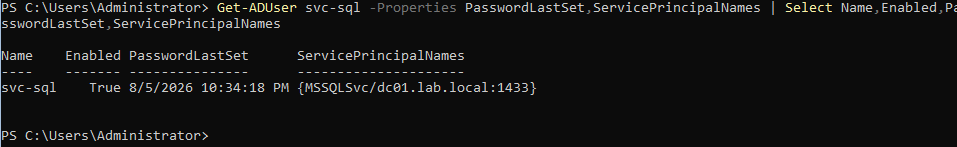

---

## 5. Prediction

Recorded before execution. Verbatim from [`data/prediction.md`](data/prediction.md).

| # | Prediction | Outcome |
|---|---|---|
| 1 | Event IDs 4624, 4768, 4769 | **Correct** — all three, 53 ms apart |
| 2 | One of each | **Correct** |
| 3 | Encryption type `0x17` | **Correct** |
| 4 | Distinguishable on `Client_Address` | **Correct** |
| 5 | `Client_Address` shows `10.168.168.58` | **Partial** — logged as `::ffff:10.168.168.58` |
| 6 | No enumeration telemetry | **Correct** — zero LDAP events |

Prediction 5 is not a cosmetic miss. The IPv4-mapped IPv6 form means any detection
matching `Client_Address` on equality against `10.168.168.58` silently never fires.
Every rule in this Act uses substring matching as a result.

### Correction made during the run

Going into prediction 6, I expected that if SPN enumeration generated no LDAP events,
that silence would mean the technique had *succeeded* at evading detection. It
doesn't, and the distinction turned out to matter for how the tier framework works.

Detection silence and attack success are independent axes. The attack succeeded in all
six runs regardless of what was logged. What the LDAP null result actually shows is
that the enumeration phase was never a detection surface to begin with — the attack's
entire visibility lives in the TGS-REQ. Silence during reconnaissance buys the
attacker nothing, because the ticket request still fires either way.

That reframing is what makes Tier 3 structural rather than simply the rule that
happened to catch everything.

---

## 6. Execution

**Primary run — 2026-08-06 02:41:33**

```bash
impacket-GetUserSPNs lab.local/jdoe:'Password123!' \
  -dc-ip 10.168.168.250 -request -outputfile kerberoast.hash
```

Full event chain, 53 ms end to end:

| Time | EventCode | Account_Name | Service_Name | Client_Address | Etype |
|---|---|---|---|---|---|
| 02:41:33.816 | 4624 | `jdoe` | — | — | — |
| 02:41:33.844 | 4768 | `jdoe` | `krbtgt` | `::ffff:10.168.168.58` | `0x17` |
| 02:41:33.869 | 4769 | `jdoe@LAB.LOCAL` | `svc-sql` | `::ffff:10.168.168.58` | `0x17` |

No 4770, 4771, 4772, or 4773 events were generated.

**The 4768 also returned `0x17`.** The RC4 artifact is present on two event types, not
one. The detections in [§8](#8-detection-engineering) key only on 4769 and therefore
leave that surface uncovered — noted in [Limitations](#14-limitations).

**Field naming, worth recording precisely:**

- `Account_Name` carries the *requesting* principal only. The target service account
  appears in `Service_Name`. A rule that inverts these cannot fire.
- `Account_Name` formatting differs by event type: `jdoe` on the 4768,
  `jdoe@LAB.LOCAL` on the 4769.
- `Service_Name` on the 4769 names the target *account* (`svc-sql`), not the SPN
  string.

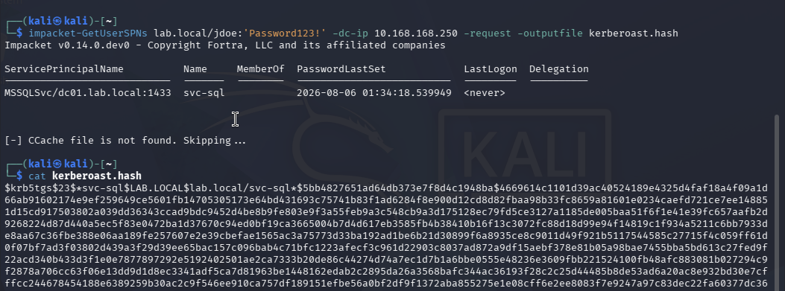

---

## 7. Observed Telemetry

### Baseline

24-hour window preceding the variation series, 2026-08-07:

| Metric | Value |
|---|---|
| Total 4769 events | 9 |
| Encryption types | `0x12` (AES256) — 100% |
| Client addresses | `::1` (loopback) — 100% |
| Requesting principals | `DC01$`, `Administrator` only |

A separate baseline taken 2026-08-06 recorded 29 events across its preceding 24 hours.
The two windows differ because the DC was powered off for part of the intervening
period. Both figures are reported rather than reconciled into a single number.

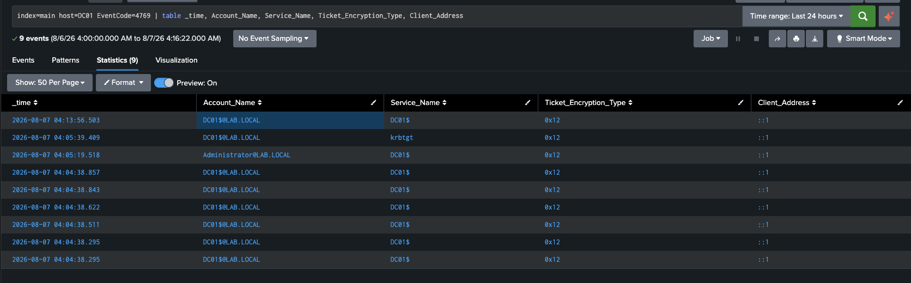

### LDAP enumeration — null result

`GetUserSPNs` queries LDAP for every SPN-bearing account before requesting any ticket.
A search across 4662, 4661, and 5136 for the attack window returned **zero
attack-attributable events**.

This null result is load-bearing, so it was verified rather than assumed: a single
4662 generated by `DC01$` twelve minutes earlier appears in the same search. **The
collection path works. The silence is real.**

The cause is a default-configuration property rather than a structural one — object
reads generate 4662 only where a SACL is set, and default Active Directory does not
audit reads on user objects. **A defender can close this gap.** It is the mirror image
of Tier 1, which an attacker can close.

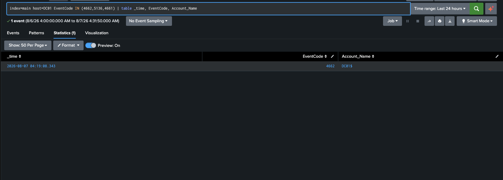

---

## 8. Detection Engineering

Three rules, one per tier. Sigma sources in [`detections/`](detections/); Splunk
equivalents in [`detections/kerberoast.spl`](detections/kerberoast.spl).

### Tier 1 — Artifact · RC4 encryption type

```spl
index=main host=DC01 EventCode=4769 Ticket_Encryption_Type=0x17
NOT Client_Address="::1"
```

Keys on the RC4 ticket that Kerberoasting tooling requests by default. Separation is
clean here — the environment's organic traffic is 100% AES256.

### Tier 2 — Behavioural · distinct SPNs per principal per minute

```spl
index=main host=DC01 EventCode=4769 NOT Client_Address="::1"
| bin _time span=1m
| stats dc(Service_Name) as distinct_services, values(Service_Name) as services
    by _time, Account_Name
| where distinct_services >= 3
```

Keys on the pattern of requesting many services at once rather than on any property of
an individual ticket. `dc()` counts distinct services rather than raw events, which is
what separates a sweep from ordinary repetition.

### Tier 3 — Structural · user principal requesting a service ticket remotely

```spl
index=main host=DC01 EventCode=4769
NOT Client_Address="::1" NOT Account_Name="DC01$*"
```

Keys on the TGS-REQ itself — the one operation Kerberoasting cannot skip.

### Validation

All three rules pass `sigma check` and compile under the `splunk_windows` pipeline.

```bash
sigma check detections/
sigma convert -t splunk -p splunk_windows detections/act2_tier2_kerberoast_spn_sweep.yml
```

The Tier 2 correlation rule compiled to an aggregation structurally identical to the
hand-written SPL above — same binning, same distinct count, same grouping, same
threshold. Two independent derivations converging on one query is meaningful
validation of the detection logic.

**One caveat on the validation gate itself:** `sigma check` reports `Found 0 errors`
against an empty directory as readily as against three passing rules. The output is
identical. Any CI step built on it must additionally assert a minimum rule count, or
it will report success indefinitely after a path breaks.

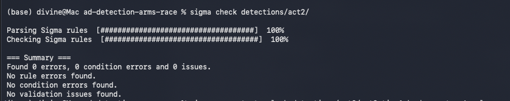

---

## 9. Variation Testing

Six runs. Each variation targets a specific tier's assumption.

**Phase boundary** — after Run 3, three additional SPN accounts were seeded. Runs 1–3
executed against a single-SPN domain; Runs 4–5 against a four-SPN domain. Both states
are documented separately rather than merged.

| Run | Time | Variation | Etype | 4769s |
|---|---|---|---|---|
| Primary | 08-06 02:41:33 | Default | `0x17` | 1 |
| 1 | 08-07 04:31:01 | Default | `0x17` | 1 |
| 2 | 08-07 04:41:21 | `msDS-SupportedEncryptionTypes=8` (AES128) | **`0x11`** | 1 |
| 3 | 08-07 04:49:18 | `-request-user svc-sql` | `0x17` | 1 |
| 4 | 08-07 05:01:36 | Broad sweep, 4 SPN accounts | `0x17` | **4** |
| 5 | 08-07 05:05:38 | `-request-user svc-sql`, paced +4 min | `0x17` | 1 |

### Run 2 — defeating Tier 1

Setting `msDS-SupportedEncryptionTypes=8` on `svc-sql` removed RC4 from the KDC's
options and forced AES128. The Tier 1 query returned zero results for that window.

**The roast still succeeded.** A valid, crackable ticket was returned. The detection
died; the attack did not.

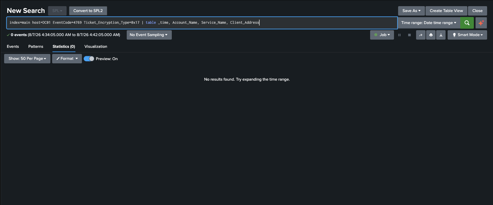

### Run 4 — the burst

Four service tickets in **79 milliseconds** — 05:01:36.271 through .350. No human
workflow requests four distinct services in under a tenth of a second. Tier 2 fired
cleanly.

### Run 5 — defeating Tier 2

A single SPN, paced four minutes after the sweep. Tier 2 returned nothing.

The attacker still obtained `svc-sql` — the only crackable target in the set. **The
evasion cost was zero.** The three discarded tickets had no value to begin with; the
broad sweep was convenience, not necessity.

Lowering the threshold to `>= 1` does catch Run 5 — and would also fire on every
legitimate service ticket in a production domain. **The threshold that closes the gap
is the threshold that buries the SOC.**

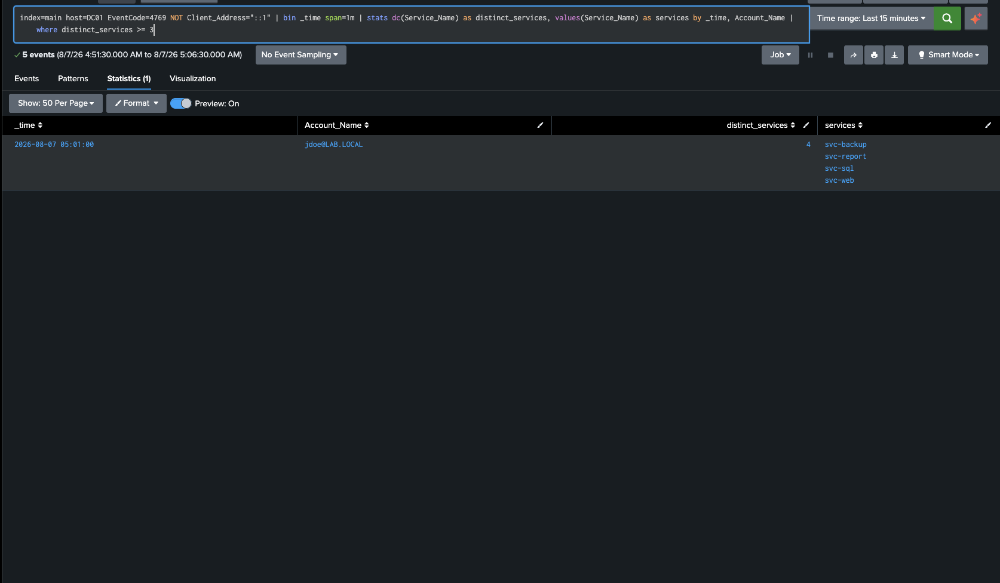
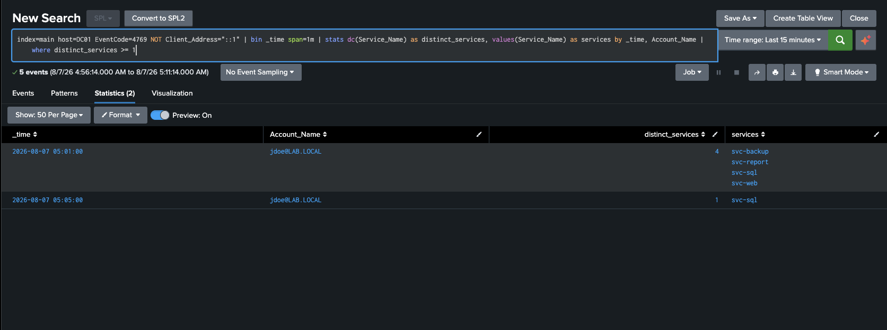

### Tier 3 against everything

All eight attack events across the variation series — including the AES run that
defeated Tier 1 and the paced run that defeated Tier 2.

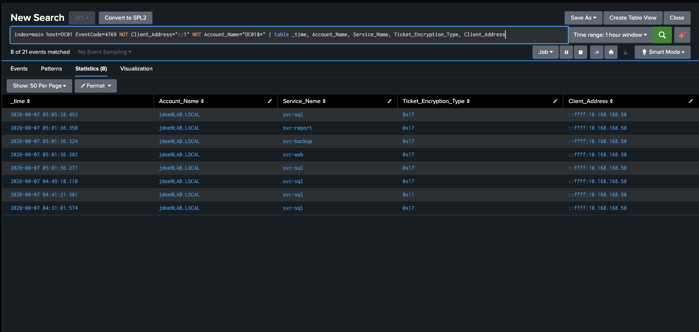

---

## 10. Results Matrix

| | Tier 1 (RC4) | Tier 2 (≥3 SPN/min) | Tier 3 (structural) |
|---|---|---|---|
| Run 1 — default | fires | — | fires |
| Run 2 — AES128 | **silent** | — | fires |
| Run 3 — single SPN | fires | — | fires |
| Run 4 — sweep | fires | **fires** | fires |
| Run 5 — paced single | fires | **silent** | fires |
| **Coverage** | 4 / 5 runs | 1 / 5 runs | **8 / 8 events** |

Tier 1 and Tier 2 fail to *different* evasions. Run 5 was caught by Tier 1; Run 2 was
caught by Tier 2. Neither is sufficient alone; together they cover more than either
does independently. That is the layered-detection argument, measured rather than
asserted.

---

## 11. Offline Cracking

| Hash | Mode | Etype | Speed | Result |
|---|---|---|---|---|
| `kerberoast.hash` | 13100 | 23 (RC4) | **4257 H/s** | `Falcon2019!` |
| `kerberoast-aes.hash` | 19600 | 17 (AES128) | **15 H/s** | `Falcon2019!` |
| `kerberoast-multi.hash` | 13100 | 23 (RC4) | 8285 H/s | 4 / 4 recovered |

**A 284× penalty for AES128** — same password, same account, same wordlist.

AES does not make Kerberoasting fail. It makes it expensive. Against `Falcon2019!` that
is the difference between one second and eleven; against a random 20-character password
it is the difference between feasible and not. **The password remains the weakness.
Encryption changes only the price.**

The mechanism is visible in hashcat's own output rather than taken on faith. The AES
run reports `Slow-Hash-SIMD-LOOP` and `Iteration:3072-4095` — the 4096 PBKDF2
iterations of Kerberos AES key derivation. The RC4 run reports `Not-Iterated`: a single
unsalted pass.

**Etype notation trap.** The hash prefix is decimal; the Splunk field is hexadecimal.
`$23$` ↔ `0x17` (RC4). `$17$` ↔ `0x11` (AES128). The `$17$`/`0x17` collision across two
runs in this Act is a genuine footgun and the mapping is stated explicitly for that
reason.

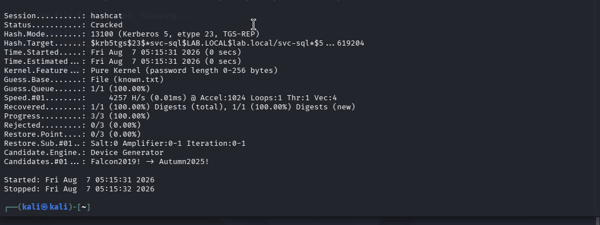
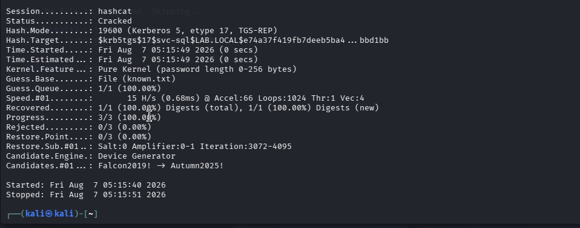

---

## 12. Findings

**1 · Kerberoasting logs faithfully; AS-REP roasting does not.**
One 4769 per service ticket, across every run. Act 1 produced one event for six
requests. Same DC, same SIEM, opposite fidelity. Both look identical from the SOC chair
— no alert — and require completely different remediations. One is a logging gap; the
other is a tuning problem.

**2 · Hardening trades detection for protection.**
One attribute change on one account silenced the RC4 rule *and* imposed a 284×
cracking penalty. The rule degrades in precisely the environments that are best
secured.

**3 · The evasion cost for Tier 2 is zero.**
Run 5 achieved the full objective at 25% of the telemetry. The behavioural threshold
does not price the attack — it prices the attacker's laziness.

**4 · Reconnaissance is invisible by default.**
SPN enumeration left no trace in a verified-live collection path. The TGS-REQ is the
sole point of visibility for the entire technique.

**5 · Field-name portability is a real deployment cost.**
The Sigma rules compile cleanly but emit raw Windows field names
(`TicketEncryptionType`), while the Splunk TA presents `Ticket_Encryption_Type`. The
`splunk_windows` pipeline resolves log source but not field naming. Portable detection
logic still requires a per-deployment mapping layer, and a rule that validates is not
the same as a rule that fires.

---

## 13. What Surprised Me

I expected Tier 1 to die. That was the point of building it — a rule keyed on RC4 was
always going to lose to an attacker who requests AES instead.

What I didn't expect was *how* it died. I killed it by hardening the target account,
not by evading anything. Setting `msDS-SupportedEncryptionTypes` on `svc-sql` is
something a defender does deliberately, following good advice, to make the ticket
harder to crack. The RC4 rule went silent as a side effect. Nobody attacked the
detection — it was collateral damage from a security improvement.

That reframed the tier for me. Tier 1 isn't only fragile against a clever attacker;
it's fragile against your own remediation program. The better an environment is
configured, the less that rule sees. If you deployed it and watched alert volume fall
over months, you could easily read that as the threat receding rather than the
detection going blind.

The cracking result is the other thing I keep coming back to. Forcing AES made the
crack 284× slower and it still fell in eleven seconds, because the password was
guessable. The cipher only ever changes the price.

If you're running this cold: build the rule you expect to lose, then actually try to
kill it. The tier label means nothing until you've watched it fail.

---

## 14. Limitations

**These results are shaped by the environment and do not transfer as stated.**

**The baseline is near-zero.** Nine 4769 events in 24 hours, all machine-account
loopback. There is no organic service-ticket traffic in this lab. Every detection here
shows perfect separation, and *that is an artifact of an empty environment.* In
production, 4769 is among the highest-volume events in the Windows Security log. This
lab systematically flatters volume-based detection.

**The Tier 2 threshold of 3 is not a production value.** It was derived from a four-SPN
domain against a zero baseline. Real thresholds require real telemetry.

**Tier 3 is viable as written only because the baseline is empty.** In production it
requires an allowlist built from an observed principal-to-service baseline — sustained
engineering work, not a filter clause. The rule is structural in what it keys on and
expensive in what it demands.

**Only 4769 was measured across the variation series.** The primary run established
that the attack also generates 4624 and 4768, and that the 4768 likewise carries the
RC4 artifact. Runs 1–5 have unmeasured footprint on both channels, and the Tier 1 rule
covers only one of the two events where the artifact appears.

**`LastLogon: <never>` was observed but not operationalised.** An SPN-bearing account
with no logon history is a strong indicator of Kerberoastability and is unused by any
rule in this Act.

**LDAP visibility was not tested with SACLs enabled.** The null result reflects default
audit configuration only. Enabling SACLs on user objects would change it, and that
measurement was not taken.

**No client-side telemetry.** `DESKTOP-SOTPVJH` has no Sysmon or forwarder installed.
Process execution artifacts on the attacker-adjacent host are entirely absent.

**Two baseline windows.** 29 events (08-06) and 9 events (08-07), with the DC powered
off between them. Neither is a stable long-run figure.

**Splunk indexing lag** of approximately 1–2 minutes between event generation and
searchability.

**The target was not static.** `svc-sql`'s encryption type was modified and restored
mid-Act. Runs are timestamped and phase boundaries marked, but the environment changed
during the series.

---

## Evidence Index

All screenshots in [`screenshots/`](screenshots/). Numbers 04 and 06 are absent — those
captures were not retained from the primary run.

| # | Artifact |
|---|---|
| 01–03 | SPN registration, enumeration, baseline (primary run) |
| 05 | GetUserSPNs request and hash |
| 07–08 | Post-attack Splunk telemetry |
| 09–10 | Initial hashcat runs |
| 11 | 24-hour 4769 baseline |
| 12 | `svc-sql` target configuration |
| 13–14 | Run 1 — default RC4, terminal and Splunk |
| 15 | LDAP enumeration null result |
| 16–18 | Run 2 — AES config change, execution, telemetry |
| 19 | Tier 1 silent under AES |
| 20–21 | Run 3 — single SPN |
| 22 | Environment change — SPN seeding |
| 23–24 | Run 4 — broad sweep |
| 25–26 | Run 5 — paced single SPN |
| 27–28 | Tier 2 at threshold 3 and threshold 1 |
| 29 | Tier 3 — all runs matched |
| 30–32 | hashcat — RC4, AES128, multi-account |
| 33–35 | Sigma validation and Splunk compilation |

### Repository contents

```
act-02-kerberoasting/
├── README.md
├── artifacts/      captured TGS hashes
├── config/         target account configuration
├── data/           predictions, observations, crack output
├── detections/     Sigma rules and Splunk SPL
└── screenshots/    evidence, 33 files
```

> **Note.** Hashes and cracked plaintext in `artifacts/` and `data/` are from a
> disposable lab domain with deliberately seeded weak passwords. No production
> credential material appears in this repository.
